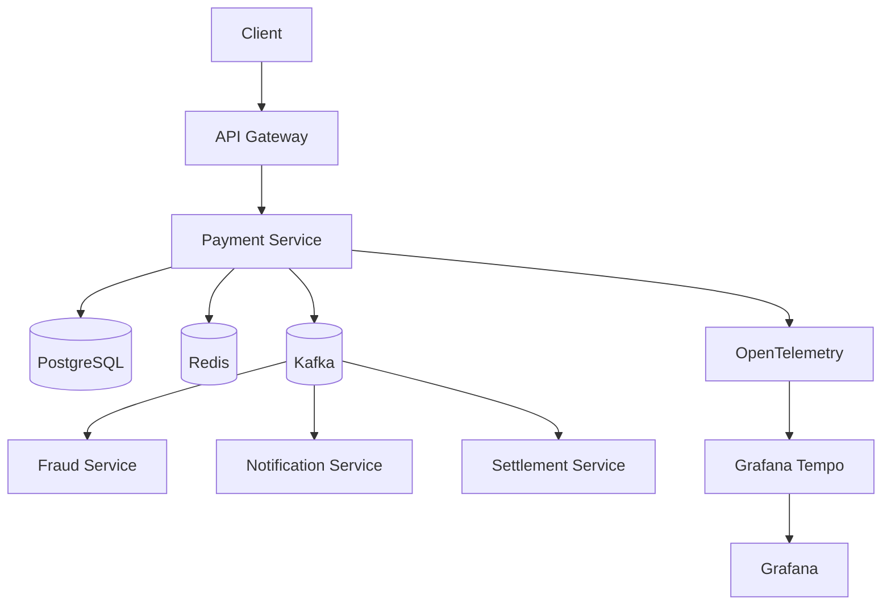

# Distributed Payment Processing Platform

A production-style distributed payment processing platform built with Java and Spring Boot, focusing on reliability, idempotency, concurrency, event-driven architecture, caching, observability, and CI/CD.

## Tech Stack

* Java 21
* Spring Boot
* Spring Data JPA / Hibernate
* PostgreSQL
* Flyway
* Redis
* Apache Kafka
* Docker
* Jenkins
* OpenTelemetry
* Grafana Tempo
* Swagger / OpenAPI
* AWS

## Core Features

* Payment lifecycle management
* Idempotent payment creation
* Optimistic locking for concurrent updates
* Redis caching
* Transactional Outbox pattern
* Kafka-based event processing
* Retry and Dead Letter Queue
* Distributed tracing with OpenTelemetry
* API documentation with Swagger/OpenAPI
* Jenkins CI pipeline
* Environment-specific configuration using Spring Profiles

## Payment APIs

| Method | Endpoint                   | Purpose            |
| ------ | -------------------------- | ------------------ |
| POST   | `/payments`                | Create payment     |
| GET    | `/payments/{id}`           | Get payment        |
| POST   | `/payments/{id}/authorize` | Authorize payment  |
| POST   | `/payments/{id}/capture`   | Capture payment    |
| POST   | `/payments/{id}/refund`    | Refund payment     |
| GET    | `/payments/{id}/status`    | Get payment status |

## Architecture



## Reliability

The project focuses on handling real-world distributed-system problems rather than implementing CRUD alone.

Key mechanisms include:

* Idempotency to prevent duplicate payments
* Database transactions for consistency
* Optimistic locking for concurrent updates
* Transactional Outbox for reliable event publishing
* Kafka retries and dead-letter processing
* Idempotent consumers
* Redis caching with database fallback

## Local Development

The project uses Docker for local infrastructure including:

* PostgreSQL
* Redis
* Kafka
* OpenTelemetry Collector
* Grafana Tempo
* Grafana

Spring profiles and environment variables are used to separate local and production configuration.

## CI/CD

Jenkins is used to build the application and validate changes automatically after commits.

## Observability

Distributed tracing is implemented using:

```text
Spring Boot
    ↓
OpenTelemetry Java Agent
    ↓
OpenTelemetry Collector
    ↓
Grafana Tempo
    ↓
Grafana
```

## Project Status

The core payment workflow, reliability mechanisms, caching, event-driven architecture, observability, API documentation, and CI pipeline have been implemented incrementally.

Further production deployment and documentation improvements will be added as the project evolves.
